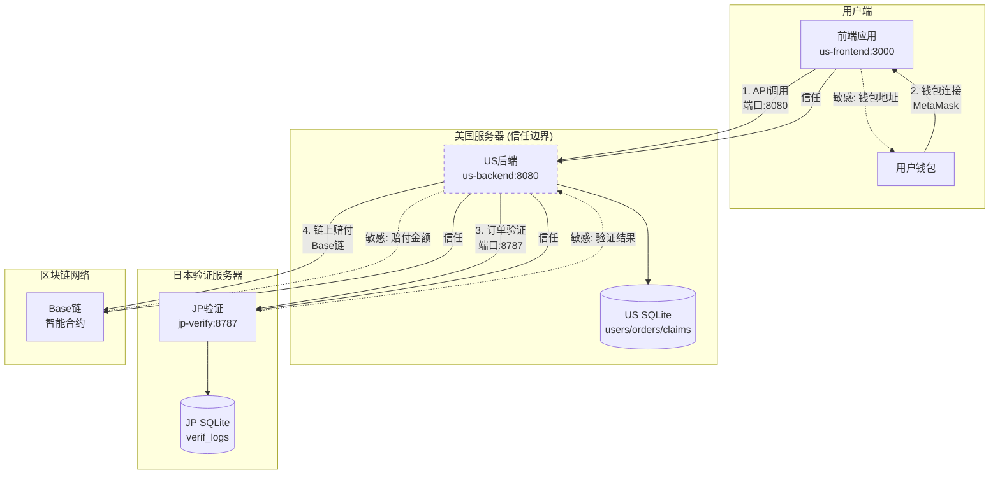

# LiqPass 系统一页图

## 系统架构概览

## 组件说明

| 组件 | 端口 | 职责 | 信任关系 |
|------|------|------|----------|
| 前端应用 | 3000 | 用户界面、钱包连接 | 信任US后端 |
| US后端 | 8080 | 业务逻辑、订单管理、理赔处理 | 信任JP验证、Base链 |
| JP验证 | 8787 | 订单真实性验证 | 被US后端信任 |
| Base链 | - | 智能合约执行赔付 | 被US后端信任 |

## 数据流说明

### 入站请求
1. **前端→US后端**：API调用（端口8080），包含产品浏览、订单创建、理赔申请等
2. **钱包→前端**：钱包连接，用于身份验证和链上操作

### 出站请求  
3. **US后端→JP验证**：订单验证请求（端口8787），验证订单真实性
4. **US后端→Base链**：链上赔付操作，执行智能合约

### 敏感数据流
- **钱包地址**：前端↔用户钱包
- **赔付金额**：US后端↔Base链  
- **验证结果**：JP验证→US后端

## 信任边界

**美国服务器构成核心信任边界**：
- 前端完全信任US后端的所有响应
- US后端信任JP验证的订单验证结果
- US后端信任Base链的智能合约执行
- 跨边界通信均需身份验证和加密保护

**信任原则**：
- 前端不直接与JP验证或Base链交互
- 所有敏感操作通过US后端代理
- 数据库隔离：US和JP各自维护独立数据库
- 链上操作需多重签名验证

*注：系统设计遵循最小信任原则，每个组件仅获得完成其职责所需的最小权限。*