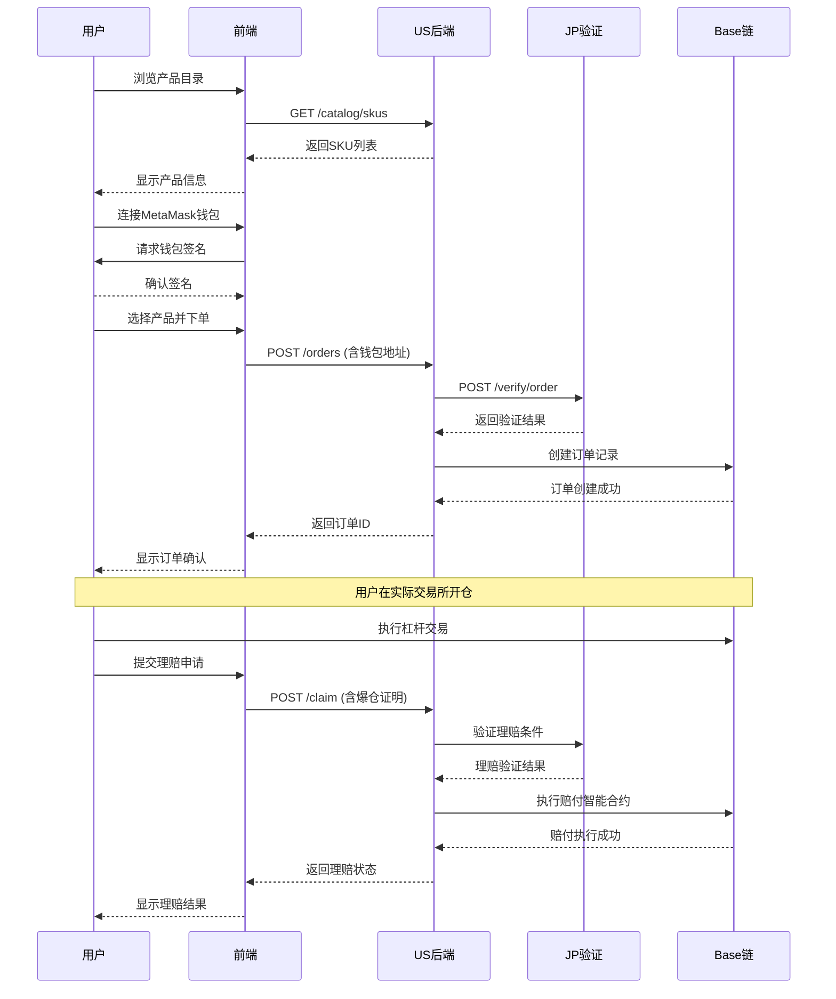
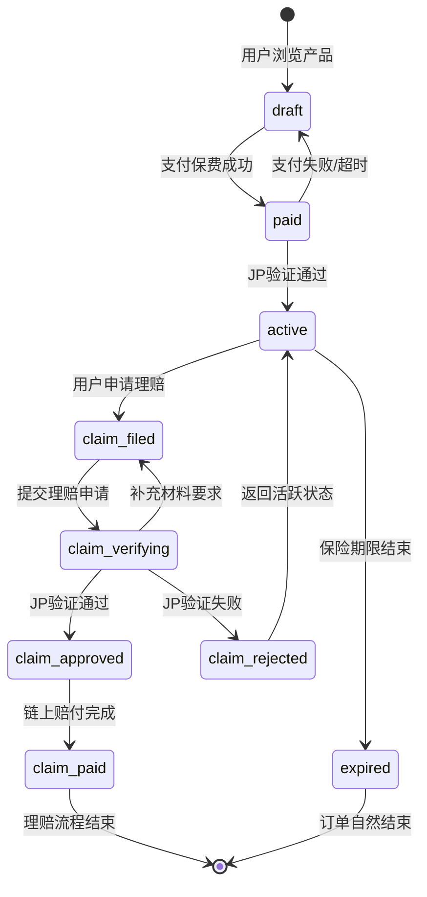

# LiqPass 业务流程与状态机

## 业务流程时序图

## 订单状态机

## 状态定义与触发条件

### 订单状态

| 状态 | 触发条件 | 可逆转条件 | 描述 |
|------|----------|------------|------|
| draft | 用户浏览产品 | - | 初始状态，用户正在选择产品 |
| paid | 用户支付保费成功 | 支付失败/超时可回退 | 保费支付完成，等待验证 |
| active | JP验证通过订单真实性 | - | 保险生效，进入保障期 |
| expired | 保险期限自然结束 | - | 保险期限结束，无理赔发生 |

### 理赔状态

| 状态 | 触发条件 | 可逆转条件 | 描述 |
|------|----------|------------|------|
| claim_filed | 用户提交理赔申请 | - | 理赔申请已提交 |
| claim_verifying | 系统接收理赔申请 | 可要求补充材料 | JP验证理赔条件 |
| claim_approved | JP验证通过理赔条件 | - | 理赔审核通过 |
| claim_rejected | JP验证拒绝理赔 | 可重新申请 | 理赔审核拒绝 |
| claim_paid | 链上赔付执行成功 | - | 赔付完成，流程结束 |

## 关键业务流程说明

### 1. 浏览→连接钱包→验证→下单
**触发条件**：用户选择产品并确认购买
**关键检查点**：
- 钱包连接状态验证
- 产品库存和价格验证
- JP验证订单真实性
- 链上订单记录创建

### 2. 开仓→理赔申请
**触发条件**：用户在交易所发生爆仓
**关键检查点**：
- 爆仓证明文件验证
- 保险期限有效性检查
- JP验证理赔条件
- 赔付金额计算

### 3. 赔付执行
**触发条件**：理赔审核通过
**关键检查点**：
- 智能合约调用权限
- 资金充足性检查
- 交易确认状态监控
- 赔付记录更新

## 状态流转规则

### 正向流转
1. **draft → paid**：用户完成支付
2. **paid → active**：JP验证通过
3. **active → claim_filed**：用户提交理赔
4. **claim_filed → claim_verifying**：系统接收申请
5. **claim_verifying → claim_approved**：验证通过
6. **claim_approved → claim_paid**：链上赔付完成

### 逆向流转（异常处理）
1. **paid → draft**：支付失败或超时
2. **claim_verifying → claim_filed**：需要补充材料
3. **claim_verifying → claim_rejected**：验证失败
4. **claim_rejected → active**：返回保障状态

## 业务规则约束

- **时间约束**：保险期限结束后不可申请理赔
- **金额约束**：赔付金额不超过保单限额
- **身份约束**：只有保单持有人可申请理赔
- **证据约束**：理赔申请需提供有效爆仓证明
- **链上约束**：所有状态变更需在链上记录