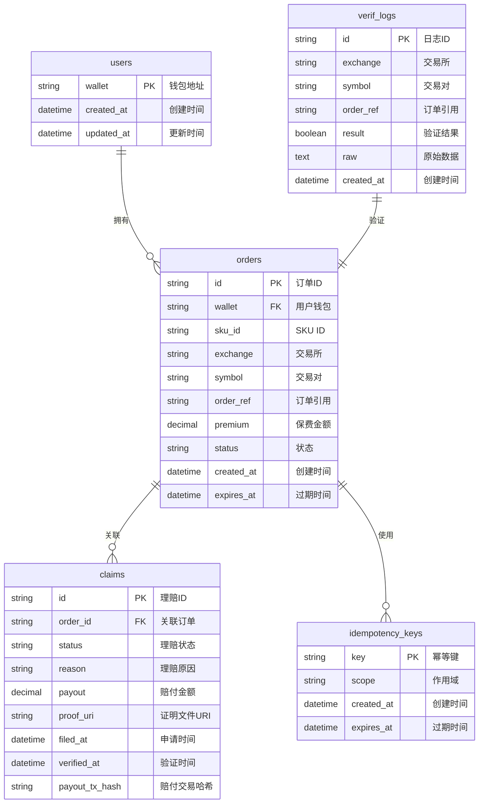

# LiqPass 数据模型与数据库边界

## 数据库架构概览



## US SQLite 数据库模型

### users 表
**用途**: 存储用户基本信息

| 字段名 | 类型 | 约束 | 描述 |
|--------|------|------|------|
| wallet | TEXT | PRIMARY KEY, NOT NULL | 用户钱包地址（小写） |
| created_at | DATETIME | NOT NULL, DEFAULT CURRENT_TIMESTAMP | 创建时间 |
| updated_at | DATETIME | NOT NULL, DEFAULT CURRENT_TIMESTAMP | 更新时间 |

**索引**:
- `PRIMARY KEY (wallet)`

**示例数据**:
```sql
INSERT INTO users (wallet) VALUES ('0x742d35cc6634c0532925a3b8d9d8b9b7c9d8b9b7');
```

### orders 表
**用途**: 存储保险订单信息

| 字段名 | 类型 | 约束 | 描述 |
|--------|------|------|------|
| id | TEXT | PRIMARY KEY, NOT NULL | 订单ID（格式：order_xxx） |
| wallet | TEXT | FOREIGN KEY, NOT NULL | 用户钱包地址 |
| sku_id | TEXT | NOT NULL | SKU产品ID |
| exchange | TEXT | NOT NULL | 交易所名称 |
| symbol | TEXT | NOT NULL | 交易对符号 |
| order_ref | TEXT | NOT NULL | 交易所订单引用 |
| premium | DECIMAL(18,8) | NOT NULL | 保费金额 |
| status | TEXT | NOT NULL | 订单状态 |
| created_at | DATETIME | NOT NULL, DEFAULT CURRENT_TIMESTAMP | 创建时间 |
| expires_at | DATETIME | NOT NULL | 过期时间 |

**索引**:
- `PRIMARY KEY (id)`
- `UNIQUE (wallet, order_ref)` - 防止重复订单
- `INDEX idx_wallet_status (wallet, status)` - 用户订单查询优化
- `INDEX idx_expires_at (expires_at)` - 过期订单清理优化

**状态枚举**: `draft`, `paid`, `active`, `expired`

**示例数据**:
```sql
INSERT INTO orders (id, wallet, sku_id, exchange, symbol, order_ref, premium, status, expires_at) 
VALUES ('order_abc123', '0x742d35cc6634c0532925a3b8d9d8b9b7c9d8b9b7', 'sku_5x_leverage', 'binance', 'BTCUSDT', 'binance_order_123', 0.05, 'active', '2024-01-02 00:00:00');
```

### claims 表
**用途**: 存储理赔申请信息

| 字段名 | 类型 | 约束 | 描述 |
|--------|------|------|------|
| id | TEXT | PRIMARY KEY, NOT NULL | 理赔ID（格式：claim_xxx） |
| order_id | TEXT | FOREIGN KEY, NOT NULL | 关联订单ID |
| status | TEXT | NOT NULL | 理赔状态 |
| reason | TEXT | NOT NULL | 理赔原因 |
| payout | DECIMAL(18,8) | NULL | 赔付金额 |
| proof_uri | TEXT | NULL | 证明文件URI |
| filed_at | DATETIME | NOT NULL, DEFAULT CURRENT_TIMESTAMP | 申请时间 |
| verified_at | DATETIME | NULL | 验证时间 |
| payout_tx_hash | TEXT | NULL | 链上交易哈希 |

**索引**:
- `PRIMARY KEY (id)`
- `FOREIGN KEY (order_id) REFERENCES orders(id)`
- `INDEX idx_order_id (order_id)` - 订单关联查询优化
- `INDEX idx_status (status)` - 状态查询优化

**状态枚举**: `filed`, `verifying`, `approved`, `rejected`, `paid`

**示例数据**:
```sql
INSERT INTO claims (id, order_id, status, reason, payout, proof_uri) 
VALUES ('claim_xyz789', 'order_abc123', 'filed', 'position_liquidated', 500.0, 'https://example.com/proof.json');
```

### idempotency_keys 表
**用途**: 防止重复操作

| 字段名 | 类型 | 约束 | 描述 |
|--------|------|------|------|
| key | TEXT | PRIMARY KEY, NOT NULL | 幂等键 |
| scope | TEXT | NOT NULL | 作用域 |
| created_at | DATETIME | NOT NULL, DEFAULT CURRENT_TIMESTAMP | 创建时间 |
| expires_at | DATETIME | NOT NULL | 过期时间 |

**索引**:
- `PRIMARY KEY (key)`
- `INDEX idx_expires_at (expires_at)` - 过期清理优化

**示例数据**:
```sql
INSERT INTO idempotency_keys (key, scope, expires_at) 
VALUES ('order_create_0x742d35cc6634c0532925a3b8d9d8b9b7c9d8b9b7_1704067200', 'order_create', '2024-01-02 00:00:00');
```

## JP SQLite 数据库模型

### verif_logs 表
**用途**: 存储验证日志

| 字段名 | 类型 | 约束 | 描述 |
|--------|------|------|------|
| id | TEXT | PRIMARY KEY, NOT NULL | 日志ID |
| exchange | TEXT | NOT NULL | 交易所名称 |
| symbol | TEXT | NOT NULL | 交易对符号 |
| order_ref | TEXT | NOT NULL | 订单引用 |
| result | BOOLEAN | NOT NULL | 验证结果 |
| raw | TEXT | NULL | 原始响应数据 |
| created_at | DATETIME | NOT NULL, DEFAULT CURRENT_TIMESTAMP | 创建时间 |

**索引**:
- `PRIMARY KEY (id)`
- `INDEX idx_exchange_order_ref (exchange, order_ref)` - 查询优化
- `INDEX idx_created_at (created_at)` - 时间范围查询优化

**示例数据**:
```sql
INSERT INTO verif_logs (id, exchange, symbol, order_ref, result, raw) 
VALUES ('verif_abc123', 'binance', 'BTCUSDT', 'binance_order_123', 1, '{"order_id": "123456", "status": "FILLED"}');
```

## 跨库关联与边界

### 数据关联规则
1. **字符串外键**: 仅使用字符串ID进行跨库关联，不做数据库级外键约束
2. **无跨库事务**: US和JP数据库完全独立，不共享事务
3. **异步同步**: 通过API调用实现数据一致性

### 关联示例
```sql
-- US数据库查询订单及关联验证日志（通过API调用JP服务）
SELECT o.*, 
       (SELECT result FROM jp_api_get_verification(o.exchange, o.order_ref)) as verification_result
FROM orders o 
WHERE o.id = 'order_abc123';

-- JP数据库记录验证日志
INSERT INTO verif_logs (exchange, order_ref, result) 
VALUES ('binance', 'binance_order_123', true);
```

### 数据一致性保障
1. **最终一致性**: 通过重试机制确保数据最终一致
2. **幂等操作**: 所有写操作支持幂等重试
3. **补偿事务**: 失败操作有对应的补偿逻辑

## 数据库初始化脚本

### US数据库初始化
```sql
-- 创建users表
CREATE TABLE IF NOT EXISTS users (
    wallet TEXT PRIMARY KEY NOT NULL,
    created_at DATETIME NOT NULL DEFAULT CURRENT_TIMESTAMP,
    updated_at DATETIME NOT NULL DEFAULT CURRENT_TIMESTAMP
);

-- 创建orders表
CREATE TABLE IF NOT EXISTS orders (
    id TEXT PRIMARY KEY NOT NULL,
    wallet TEXT NOT NULL,
    sku_id TEXT NOT NULL,
    exchange TEXT NOT NULL,
    symbol TEXT NOT NULL,
    order_ref TEXT NOT NULL,
    premium DECIMAL(18,8) NOT NULL,
    status TEXT NOT NULL CHECK (status IN ('draft', 'paid', 'active', 'expired')),
    created_at DATETIME NOT NULL DEFAULT CURRENT_TIMESTAMP,
    expires_at DATETIME NOT NULL,
    UNIQUE(wallet, order_ref)
);

CREATE INDEX IF NOT EXISTS idx_orders_wallet_status ON orders(wallet, status);
CREATE INDEX IF NOT EXISTS idx_orders_expires_at ON orders(expires_at);

-- 创建claims表
CREATE TABLE IF NOT EXISTS claims (
    id TEXT PRIMARY KEY NOT NULL,
    order_id TEXT NOT NULL,
    status TEXT NOT NULL CHECK (status IN ('filed', 'verifying', 'approved', 'rejected', 'paid')),
    reason TEXT NOT NULL,
    payout DECIMAL(18,8),
    proof_uri TEXT,
    filed_at DATETIME NOT NULL DEFAULT CURRENT_TIMESTAMP,
    verified_at DATETIME,
    payout_tx_hash TEXT,
    FOREIGN KEY (order_id) REFERENCES orders(id)
);

CREATE INDEX IF NOT EXISTS idx_claims_order_id ON claims(order_id);
CREATE INDEX IF NOT EXISTS idx_claims_status ON claims(status);

-- 创建idempotency_keys表
CREATE TABLE IF NOT EXISTS idempotency_keys (
    key TEXT PRIMARY KEY NOT NULL,
    scope TEXT NOT NULL,
    created_at DATETIME NOT NULL DEFAULT CURRENT_TIMESTAMP,
    expires_at DATETIME NOT NULL
);

CREATE INDEX IF NOT EXISTS idx_idempotency_expires ON idempotency_keys(expires_at);
```

### JP数据库初始化
```sql
-- 创建verif_logs表
CREATE TABLE IF NOT EXISTS verif_logs (
    id TEXT PRIMARY KEY NOT NULL,
    exchange TEXT NOT NULL,
    symbol TEXT NOT NULL,
    order_ref TEXT NOT NULL,
    result BOOLEAN NOT NULL,
    raw TEXT,
    created_at DATETIME NOT NULL DEFAULT CURRENT_TIMESTAMP
);

CREATE INDEX IF NOT EXISTS idx_verif_exchange_order ON verif_logs(exchange, order_ref);
CREATE INDEX IF NOT EXISTS idx_verif_created_at ON verif_logs(created_at);
```

## 数据维护策略

### 定期清理
- **过期订单**: 每日清理状态为expired的订单
- **过期幂等键**: 每小时清理过期的幂等键
- **验证日志**: 保留30天内的验证日志

### 备份策略
- **US数据库**: 每日全量备份 + 实时WAL日志
- **JP数据库**: 每日全量备份
- **备份保留**: 保留最近7天的备份