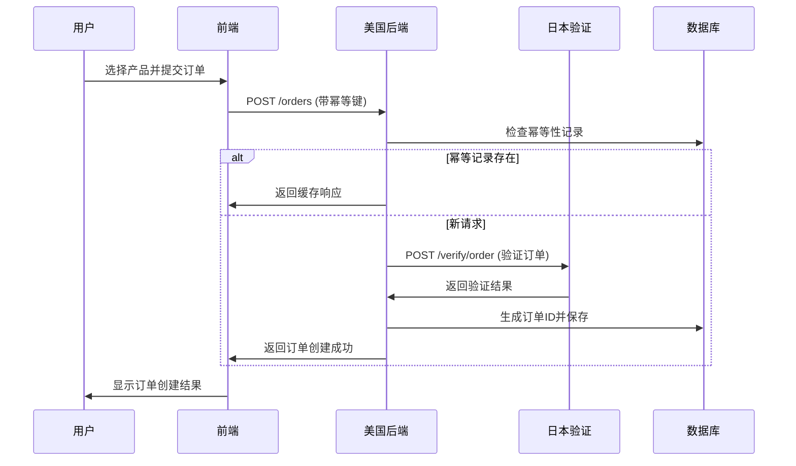
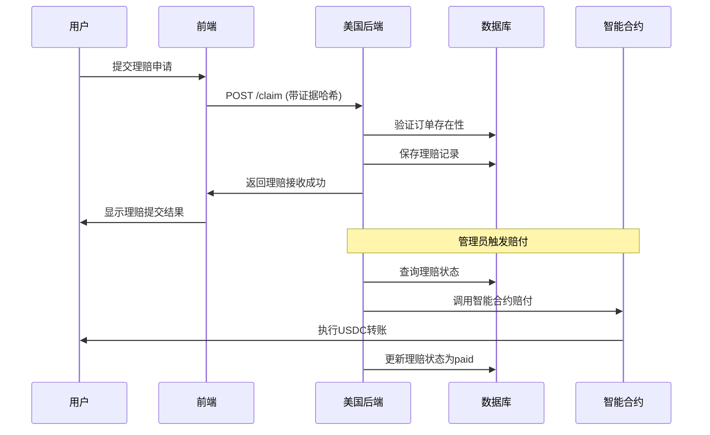

# LiqPass API接口文档

## 📋 文档概述

本文档详细描述了LiqPass项目的所有API接口规范，包括美国后端服务器、日本验证服务器以及前端API客户端的完整接口定义。

## 🏗️ API架构概览

### API服务组件

| 服务组件 | 端口 | 主要功能 | 接口数量 |
|----------|------|----------|----------|
| **美国后端服务器** | 8080 | 核心业务逻辑、订单管理、理赔处理 | 7个接口 |
| **日本验证服务器** | 8787 | 订单验证、交易所API集成 | 2个接口 |
| **前端API客户端** | - | API请求封装、错误处理 | 统一封装 |

### 通用规范

#### 1. 请求头规范
```http
Content-Type: application/json
Accept: application/json
Idempotency-Key: <unique_key>  # 幂等性保护
Authorization: Bearer <token>  # 可选认证
```

#### 2. 响应格式
```json
{
  "success": true,
  "data": {},
  "message": "操作成功",
  "timestamp": "2024-01-01T00:00:00Z"
}
```

#### 3. 错误响应格式
```json
{
  "success": false,
  "error": {
    "code": "VALIDATION_ERROR",
    "message": "参数验证失败",
    "details": ["wallet字段不能为空"]
  },
  "timestamp": "2024-01-01T00:00:00Z"
}
```

## 🔌 美国后端服务器API (端口: 8080)

### 1. 健康检查接口

#### GET /health
**描述**: 检查服务器健康状态

**请求参数**: 无

**响应示例**:
```json
{
  "success": true,
  "data": {
    "status": "healthy",
    "timestamp": "2024-01-01T00:00:00Z",
    "uptime": 3600
  },
  "message": "服务运行正常"
}
```

### 2. 产品目录接口

#### GET /catalog
**描述**: 获取可购买的保险产品目录

**请求参数**: 无

**响应示例**:
```json
{
  "success": true,
  "data": {
    "products": [
      {
        "skuId": "binance-eth-usdt-1d",
        "exchange": "binance",
        "pair": "ETH-USDT",
        "duration": "1d",
        "premium": 5000000,
        "payout": 100000000,
        "description": "Binance ETH-USDT 1天杠杆保险"
      }
    ]
  },
  "message": "产品目录获取成功"
}
```

### 3. 订单创建接口

#### POST /orders
**描述**: 创建新的保险订单

**请求头**:
```http
Idempotency-Key: order-123456789
Content-Type: application/json
```

**请求体**:
```json
{
  "wallet": "0x742d35Cc6634C0532925a3b8D6C39C5a4A5aD8F1",
  "skuId": "binance-eth-usdt-1d",
  "exchange": "binance",
  "pair": "ETH-USDT",
  "orderRef": "BINANCE_ORDER_123456"
}
```

**响应示例**:
```json
{
  "success": true,
  "data": {
    "orderId": "ord_123456789",
    "wallet": "0x742d35Cc6634C0532925a3b8D6C39C5a4A5aD8F1",
    "skuId": "binance-eth-usdt-1d",
    "exchange": "binance",
    "pair": "ETH-USDT",
    "orderRef": "BINANCE_ORDER_123456",
    "premium": 5000000,
    "payout": 100000000,
    "status": "pending",
    "createdAt": "2024-01-01T00:00:00Z"
  },
  "message": "订单创建成功"
}
```

### 4. 订单查询接口

#### GET /orders/:orderId
**描述**: 查询特定订单的详细信息

**路径参数**:
- `orderId`: 订单ID

**响应示例**:
```json
{
  "success": true,
  "data": {
    "orderId": "ord_123456789",
    "wallet": "0x742d35Cc6634C0532925a3b8D6C39C5a4A5aD8F1",
    "skuId": "binance-eth-usdt-1d",
    "exchange": "binance",
    "pair": "ETH-USDT",
    "orderRef": "BINANCE_ORDER_123456",
    "premium": 5000000,
    "payout": 100000000,
    "status": "active",
    "createdAt": "2024-01-01T00:00:00Z",
    "verifiedAt": "2024-01-01T00:01:00Z"
  },
  "message": "订单查询成功"
}
```

### 5. 理赔申请接口

#### POST /claim
**描述**: 提交保险理赔申请

**请求头**:
```http
Idempotency-Key: claim-123456789
Content-Type: application/json
```

**请求体**:
```json
{
  "orderId": "ord_123456789",
  "wallet": "0x742d35Cc6634C0532925a3b8D6C39C5a4A5aD8F1",
  "evidenceHash": "0x1234567890abcdef...",
  "reason": "杠杆交易爆仓"
}
```

**响应示例**:
```json
{
  "success": true,
  "data": {
    "claimId": "clm_123456789",
    "orderId": "ord_123456789",
    "wallet": "0x742d35Cc6634C0532925a3b8D6C39C5a4A5aD8F1",
    "evidenceHash": "0x1234567890abcdef...",
    "reason": "杠杆交易爆仓",
    "status": "pending",
    "createdAt": "2024-01-01T00:00:00Z"
  },
  "message": "理赔申请提交成功"
}
```

### 6. 理赔查询接口

#### GET /claim/:claimId
**描述**: 查询特定理赔申请的详细信息

**路径参数**:
- `claimId`: 理赔申请ID

**响应示例**:
```json
{
  "success": true,
  "data": {
    "claimId": "clm_123456789",
    "orderId": "ord_123456789",
    "wallet": "0x742d35Cc6634C0532925a3b8D6C39C5a4A5aD8F1",
    "evidenceHash": "0x1234567890abcdef...",
    "reason": "杠杆交易爆仓",
    "status": "approved",
    "createdAt": "2024-01-01T00:00:00Z",
    "approvedAt": "2024-01-01T01:00:00Z",
    "payoutTxHash": "0xabcdef1234567890..."
  },
  "message": "理赔查询成功"
}
```

### 7. 赔付执行接口

#### POST /payout
**描述**: 执行保险赔付（管理员接口）

**请求头**:
```http
Authorization: Bearer admin-token
Content-Type: application/json
```

**请求体**:
```json
{
  "claimId": "clm_123456789",
  "wallet": "0x742d35Cc6634C0532925a3b8D6C39C5a4A5aD8F1",
  "amount": 100000000
}
```

**响应示例**:
```json
{
  "success": true,
  "data": {
    "claimId": "clm_123456789",
    "wallet": "0x742d35Cc6634C0532925a3b8D6C39C5a4A5aD8F1",
    "amount": 100000000,
    "txHash": "0xabcdef1234567890...",
    "status": "paid",
    "paidAt": "2024-01-01T02:00:00Z"
  },
  "message": "赔付执行成功"
}
```

### 2. 产品目录接口

**接口路径：** `GET /catalog/skus`

**响应格式：**
```json
[
  {
    "id": "DAY_24H_FIXED",
    "title": "DAY_24H_FIXED",
    "premium": 5000,
    "payout": 100000,
    "exchange": "binance"
  },
  {
    "id": "DAY_24H_OKX",
    "title": "DAY_24H_OKX",
    "premium": 4000,
    "payout": 80000,
    "exchange": "okx"
  }
]
```

### 3. 订单创建接口

**接口路径：** `POST /orders`

**请求头：**
```
Idempotency-Key: <唯一幂等键>
Content-Type: application/json
Authorization: Bearer <token> (可选)
```

**请求参数：**
```typescript
interface CreateOrderRequest {
  skuId: string;           // 产品SKU ID
  exchange: string;        // 交易所
  pair: string;           // 交易对
  orderRef: string;       // 订单引用
  wallet: string;         // 钱包地址
  premium: number;        // 保费（分）
  payout: number;         // 赔付金额（分）
  paymentMethod: string;  // 支付方式
}
```

**响应格式：**
```json
{
  "orderId": "uuid",
  "status": "created",
  "createdAt": "2024-01-01T00:00:00.000Z"
}
```

### 4. 订单历史查询接口

**接口路径：** `GET /orders/history?wallet=<钱包地址>`

**响应格式：**
```json
[
  {
    "id": "uuid",
    "wallet": "0x...",
    "skuId": "DAY_24H_FIXED",
    "exchange": "binance",
    "pair": "BTCUSDT",
    "orderRef": "订单号",
    "premium": 5000,
    "payout": 100000,
    "status": "created",
    "createdAt": "2024-01-01T00:00:00.000Z"
  }
]
```

### 5. 理赔提交接口

**接口路径：** `POST /claim`

**请求头：**
```
Idempotency-Key: <唯一幂等键>
Content-Type: application/json
```

**请求参数：**
```typescript
interface SubmitClaimRequest {
  orderId: string;        // 订单ID
  wallet: string;         // 钱包地址
  evidenceHash: string;   // 证据哈希
  reason?: string;        // 理赔原因（默认：liquidation）
}
```

**响应格式：**
```json
{
  "claimId": "uuid",
  "status": "received",
  "createdAt": "2024-01-01T00:00:00.000Z"
}
```

### 6. 理赔状态查询接口

**接口路径：** `GET /claim/:claimId`

**响应格式：**
```json
{
  "claimId": "uuid",
  "status": "received",
  "orderId": "uuid",
  "wallet": "0x...",
  "evidenceHash": "hash",
  "reason": "liquidation",
  "createdAt": "2024-01-01T00:00:00.000Z",
  "payoutAmount": 100000,
  "skuId": "DAY_24H_FIXED",
  "exchange": "binance",
  "pair": "BTCUSDT",
  "orderRef": "订单号",
  "premium": 5000
}
```

### 7. 管理员赔付接口

**接口路径：** `POST /admin/payout`

**请求参数：**
```typescript
interface AdminPayoutRequest {
  claimId: string;        // 理赔ID
}
```

**响应格式：**
```json
{
  "message": "Payout transaction sent successfully",
  "claimId": "uuid",
  "recipient": "0x...",
  "amount": "1000000000",
  "transactionHash": "0x..."
}
```

## 🇯🇵 日本验证服务器API (端口: 8787)

### 1. 健康检查接口

#### GET /health
**描述**: 检查验证服务器健康状态

**请求参数**: 无

**响应示例**:
```json
{
  "success": true,
  "data": {
    "status": "healthy",
    "timestamp": "2024-01-01T00:00:00Z",
    "verifyMode": "real"
  },
  "message": "验证服务运行正常"
}
```

### 2. 订单验证接口

#### POST /verify/order
**描述**: 验证订单信息的有效性

**请求头**:
```http
Content-Type: application/json
```

**请求体**:
```json
{
  "exchange": "binance",
  "pair": "ETH-USDT",
  "orderRef": "BINANCE_ORDER_123456",
  "apiKey": "binance_api_key_encrypted",
  "apiSecret": "binance_api_secret_encrypted"
}
```

**响应示例**:
```json
{
  "success": true,
  "data": {
    "valid": true,
    "orderExists": true,
    "orderStatus": "active",
    "leverage": 10,
    "positionSize": 1000,
    "verifiedAt": "2024-01-01T00:00:00Z"
  },
  "message": "订单验证成功"
}
```

## 🔗 前端API客户端接口

### 1. API客户端配置

**环境变量：**
```typescript
// 默认配置
const DEFAULT_US_BASE = '/api/verify';
const DEFAULT_JP_BASE = 'http://127.0.0.1:8787';

// 实际使用的配置
const US_API_BASE = process.env.VITE_US_BACKEND_BASE || DEFAULT_US_BASE;
const JP_API_BASE = process.env.VITE_JP_VERIFY_BASE || DEFAULT_JP_BASE;
```

### 2. 通用API请求函数

**函数签名：**
```typescript
async function apiRequest<T = unknown>(
  path: string,
  options: ApiRequestOptions = {}
): Promise<T>

interface ApiRequestOptions extends RequestInit {
  parseJson?: boolean;
}
```

**使用示例：**
```typescript
// 获取产品目录
const skus = await apiRequest<SkuOption[]>('/catalog/skus');

// 提交订单
const order = await apiRequest<OrderResponse>('/orders', {
  method: 'POST',
  body: JSON.stringify(orderData)
});
```

### 3. 验证服务接口

**获取产品SKU列表：**
```typescript
async function fetchSkus(): Promise<SkuOption[]>

interface SkuOption {
  code: string;
  label: string;
  description?: string;
  premium?: number;
  payout?: number;
  exchange?: string;
}
```

**提交订单验证：**
```typescript
async function submitVerification(
  request: VerificationRequest,
  apiKeys?: ExchangeApiKeys
): Promise<VerificationResponse>

interface VerificationRequest {
  exchange: ExchangeId;      // 'OKX' | 'Binance'
  pairId: TradingPairId;     // 交易对ID
  orderId: string;          // 订单ID
  wallet: string;           // 钱包地址
  skuCode: string;          // SKU代码
  env: string;              // 环境
  principal: number;        // 本金
  leverage: number;         // 杠杆
  refCode?: string;         // 推荐码
}

interface VerificationResponse {
  status: string;
  exchange?: string;
  pair?: string;
  orderRef?: string;
  eligible?: boolean;
  parsed?: {
    side?: string;
    avgPx?: string;
    qty?: string;
    liqPx?: string;
  };
  quote?: {
    premium?: number;
    payoutCap?: number;
    currency?: string;
  };
  evidenceHint?: string;
  diag?: unknown[];
}
```

### 4. API密钥处理

**支持的交易所API密钥：**
```typescript
interface ExchangeApiKeys {
  binanceApiKey?: string;
  binanceSecretKey?: string;
  okxApiKey?: string;
  okxSecretKey?: string;
  okxPassphrase?: string;
}
```

**API密钥自动处理：**
- Binance: 自动添加 `X-MBX-APIKEY` 请求头
- OKX: 自动添加 `OK-ACCESS-KEY` 和 `OK-ACCESS-PASSPHRASE` 请求头

## 🔒 安全机制

### 1. 幂等性控制

所有写操作接口（订单创建、理赔提交）都要求提供幂等键：
```
Idempotency-Key: <唯一幂等键>
```

### 2. CORS配置

**美国后端CORS配置：**
```javascript
{
  origin: ['http://localhost:5173', 'https://your-domain.com'],
  methods: ['GET', 'POST', 'OPTIONS'],
  allowedHeaders: ['Content-Type', 'Authorization', 'Idempotency-Key'],
  credentials: true
}
```

**日本验证服务器CORS配置：**
```javascript
{
  origin: '*',
  methods: ['GET', 'POST', 'OPTIONS'],
  allowedHeaders: ['Content-Type', 'Authorization', 'Idempotency-Key']
}
```

### 3. 错误处理

**API错误格式：**
```typescript
interface ApiErrorPayload {
  status: number;
  message: string;
  body?: unknown;
}

class ApiError extends Error {
  readonly status: number;
  readonly body?: unknown;
}
```

## 📊 数据流处理

### 1. 订单创建流程



### 2. 理赔处理流程



## 🔧 部署配置

### 环境变量配置

**美国后端环境变量：**
```bash
# 服务器配置
PORT=8080
ALLOW_ORIGIN=http://localhost:5173

# 数据库配置
DB_PATH=./data/orders.db
LOG_PATH=./logs/server.log

# 区块链配置
PAYOUT_PRIVATE_KEY=<私钥>
BASE_RPC_URL=https://mainnet.base.org
CONTRACT_ADDRESS=0x9552b58d323993f84d01e3744f175f47a9462f94

# 业务配置
PAYOUT_MODE=simulate
DEFAULT_PAYOUT_ADDRESS=0x00195EcF4FF21aB985b13FC741Cdf276C71D88A1
```

**日本验证服务器环境变量：**
```bash
# 服务器配置
JP_PORT=8787
VERIFY_MODE=real

# 交易所API配置
OKX_BASE_URL=https://www.okx.com
BINANCE_BASE_URL=https://api.binance.com
```

**前端环境变量：**
```bash
# API端点配置
VITE_US_BACKEND_BASE=/api/verify
VITE_JP_VERIFY_BASE=http://127.0.0.1:8787
```

## 📝 使用示例

### 前端调用示例

```typescript
import { fetchSkus, submitVerification } from './services/verify';

// 获取产品列表
const skus = await fetchSkus();

// 提交订单验证
const verificationResult = await submitVerification({
  exchange: 'Binance',
  pairId: 'BTCUSDT',
  orderId: '123456',
  wallet: '0x742d35Cc6634C0532925a3b8D6C0C5C68b7486eD',
  skuCode: 'DAY_24H_FIXED',
  env: 'production',
  principal: 1000,
  leverage: 10
}, {
  binanceApiKey: 'your-api-key',
  binanceSecretKey: 'your-secret-key'
});
```

### 后端调用示例

```javascript
// 创建订单
const response = await fetch('http://localhost:8080/orders', {
  method: 'POST',
  headers: {
    'Content-Type': 'application/json',
    'Idempotency-Key': 'unique-key-123'
  },
  body: JSON.stringify({
    skuId: 'DAY_24H_FIXED',
    exchange: 'binance',
    pair: 'BTCUSDT',
    orderRef: 'order-123',
    wallet: '0x742d35Cc6634C0532925a3b8D6C0C5C68b7486eD',
    premium: 5000,
    payout: 100000,
    paymentMethod: 'usdc'
  })
});
```

## 🔄 版本历史

| 版本 | 日期 | 描述 |
|------|------|------|
| v1.0 | 2024-01-01 | 初始版本，包含基础API接口 |
| v1.1 | 2024-01-15 | 添加日本验证服务器接口 |
| v1.2 | 2024-02-01 | 完善前端API客户端 |

---

**文档维护：** LiqPass开发团队  
**最后更新：** 2024-01-01