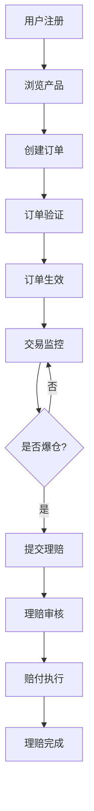
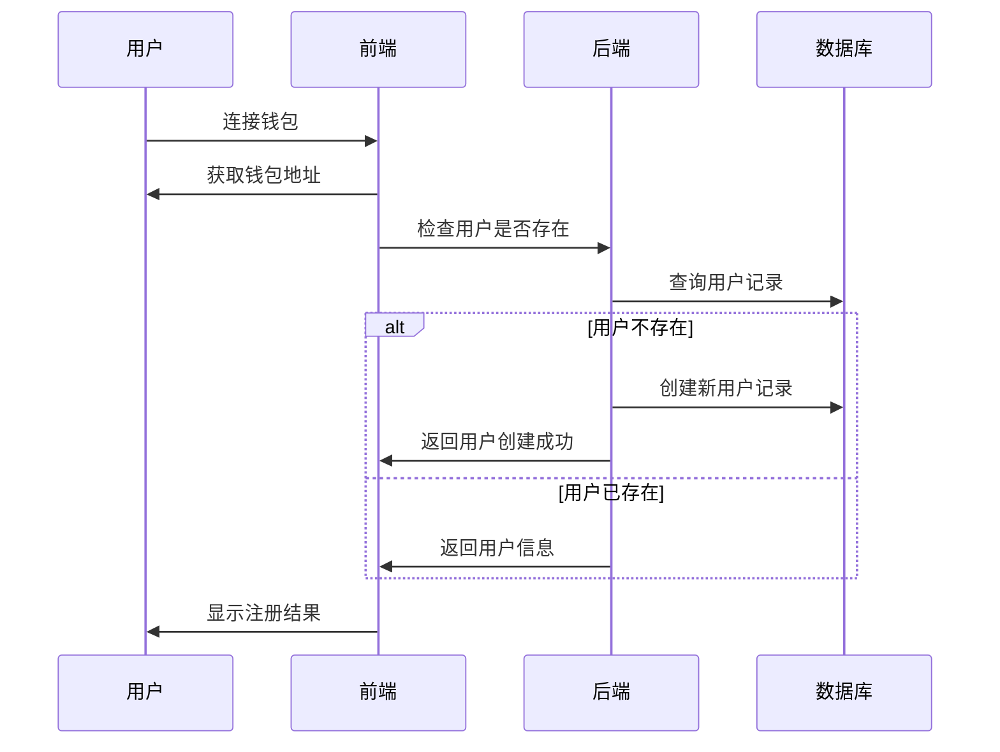
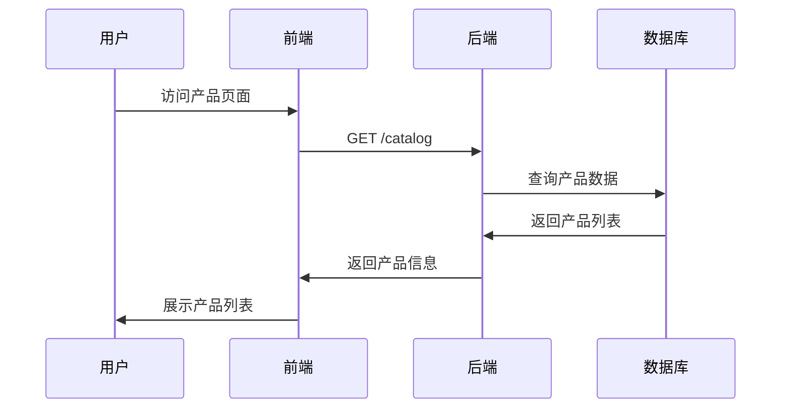
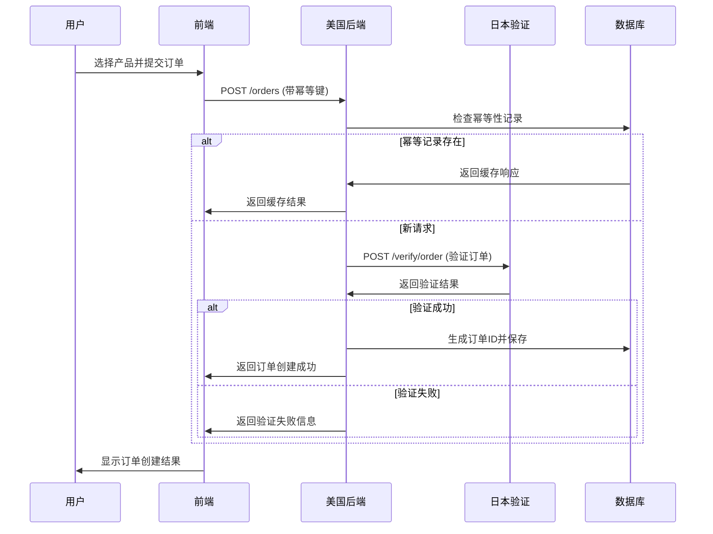
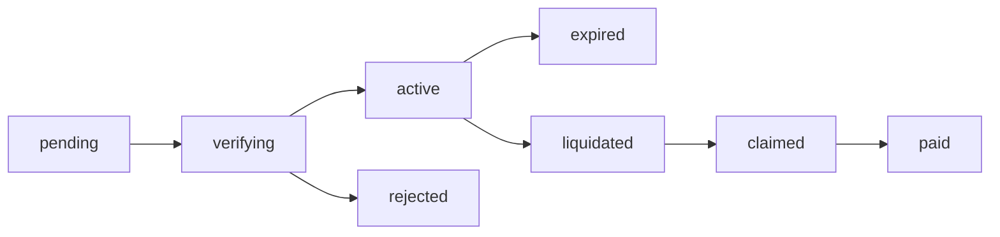
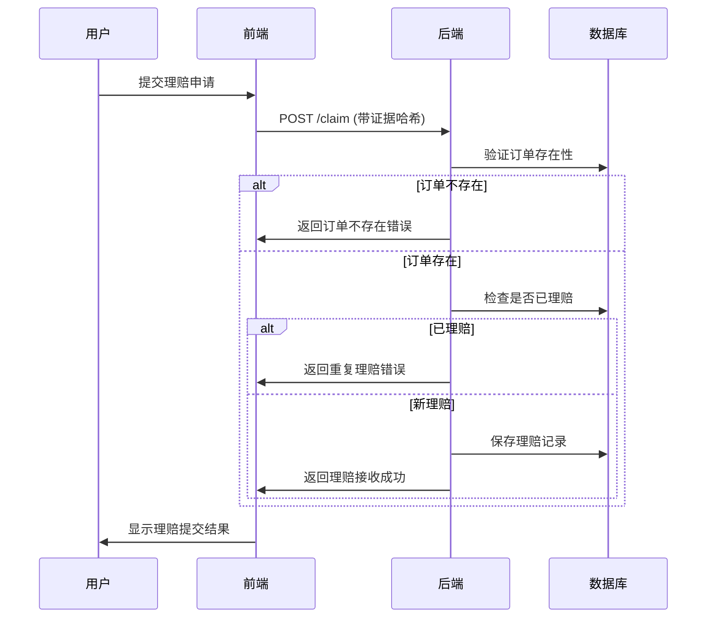
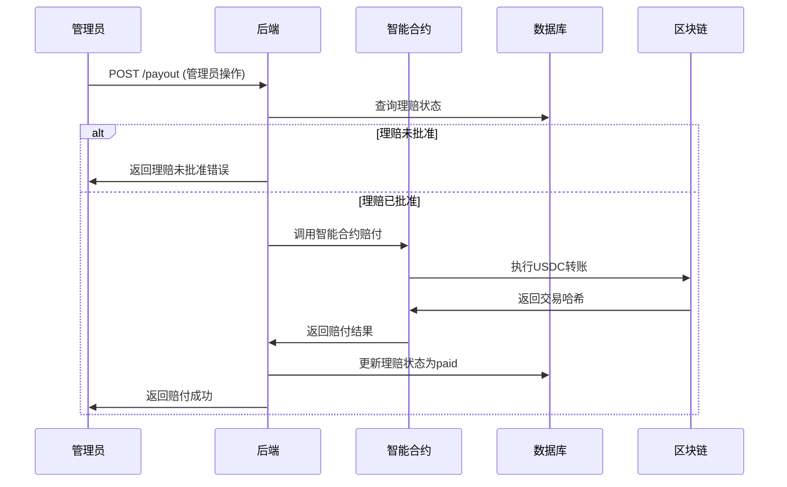

# LiqPass 业务流程文档

## 📋 文档概述

本文档详细描述了LiqPass项目的核心业务流程，包括用户注册、产品购买、订单验证、理赔申请、赔付执行等完整业务逻辑。

## 🏗️ 业务架构概览

### 核心业务组件

| 业务模块 | 主要功能 | 涉及组件 |
|----------|----------|----------|
| **用户管理** | 用户注册、钱包绑定 | 前端、后端 |
| **产品目录** | 保险产品展示、定价 | 后端、数据库 |
| **订单管理** | 订单创建、验证、状态跟踪 | 前端、后端、日本验证服务器 |
| **理赔管理** | 理赔申请、审核、赔付 | 前端、后端、智能合约 |
| **资金管理** | 保费收取、赔付执行 | 智能合约、区块链 |

### 业务状态流转



## 👤 用户管理流程

### 1. 用户注册流程

#### 流程描述
用户通过连接钱包完成注册，系统自动创建用户账户并绑定钱包地址。

#### 流程步骤


#### 数据模型
```typescript
interface User {
  wallet: string;           // 钱包地址
  createdAt: Date;          // 创建时间
  lastLoginAt: Date;        // 最后登录时间
  totalOrders: number;      // 总订单数
  totalClaims: number;      // 总理赔数
  totalPayout: number;      // 总赔付金额
}
```

## 📦 产品目录流程

### 1. 产品展示流程

#### 流程描述
系统展示可购买的杠杆交易保险产品，包括产品详情、保费、赔付金额等信息。

#### 流程步骤


#### 产品数据模型
```typescript
interface InsuranceProduct {
  skuId: string;           // 产品SKU ID
  exchange: string;        // 交易所
  pair: string;           // 交易对
  duration: string;        // 保险期限
  premium: number;         // 保费（分）
  payout: number;          // 赔付金额（分）
  description: string;     // 产品描述
  minLeverage: number;     // 最小杠杆
  maxLeverage: number;     // 最大杠杆
  riskLevel: string;       // 风险等级
}
```

## 📋 订单管理流程

### 1. 订单创建流程

#### 流程描述
用户选择产品并提交订单，系统验证订单信息并创建保险订单。

#### 流程步骤


#### 订单状态流转


#### 订单数据模型
```typescript
interface Order {
  orderId: string;         // 订单ID
  wallet: string;          // 钱包地址
  skuId: string;          // 产品SKU ID
  exchange: string;        // 交易所
  pair: string;           // 交易对
  orderRef: string;       // 订单引用
  premium: number;        // 保费
  payout: number;         // 赔付金额
  status: OrderStatus;    // 订单状态
  createdAt: Date;        // 创建时间
  verifiedAt?: Date;      // 验证时间
  expiredAt?: Date;       // 过期时间
  liquidatedAt?: Date;    // 爆仓时间
}
```

### 2. 订单验证流程

#### 流程描述
日本验证服务器验证用户提交的订单信息是否真实有效。

#### 验证逻辑
```typescript
interface OrderVerification {
  exchange: string;        // 交易所
  pair: string;           // 交易对
  orderRef: string;       // 订单引用
  apiKey: string;         // API密钥
  apiSecret: string;      // API密钥
  
  // 验证步骤
  steps: [
    '连接交易所API',
    '查询订单信息',
    '验证订单状态',
    '检查杠杆设置',
    '验证交易对',
    '生成验证报告'
  ]
}
```

## 🚨 理赔管理流程

### 1. 理赔申请流程

#### 流程描述
用户在交易爆仓后提交理赔申请，系统记录理赔信息并等待审核。

#### 流程步骤


#### 理赔数据模型
```typescript
interface Claim {
  claimId: string;        // 理赔ID
  orderId: string;        // 订单ID
  wallet: string;         // 钱包地址
  evidenceHash: string;   // 证据哈希
  reason: string;         // 理赔原因
  status: ClaimStatus;    // 理赔状态
  createdAt: Date;        // 创建时间
  reviewedAt?: Date;      // 审核时间
  approvedAt?: Date;      // 批准时间
  paidAt?: Date;         // 赔付时间
  payoutTxHash?: string;  // 赔付交易哈希
}
```

### 2. 理赔审核流程

#### 流程描述
管理员审核理赔申请，验证爆仓证据的真实性。

#### 审核标准
```typescript
interface ClaimReviewCriteria {
  // 证据验证
  evidenceValid: boolean;     // 证据有效性
  liquidationConfirmed: boolean; // 爆仓确认
  timeframeValid: boolean;    // 时间范围有效
  amountCorrect: boolean;     // 金额正确
  
  // 自动审核规则
  autoApproveConditions: [
    '证据哈希匹配',
    '订单状态为liquidated',
    '理赔时间在保险期内',
    '首次理赔申请'
  ]
}
```

## 💰 赔付执行流程

### 1. 赔付审批流程

#### 流程描述
管理员审批通过理赔申请后，系统执行链上赔付操作。

#### 流程步骤


#### 智能合约交互
```solidity
// 赔付函数调用
function payout(
    address recipient,
    uint256 amount,
    string memory claimId
) external onlyOwner returns (bool) {
    require(whitelist[recipient], "Recipient not whitelisted");
    require(amount > 0, "Invalid amount");
    require(!payouts[claimId], "Claim already paid");
    
    // 执行赔付
    bool success = usdc.transfer(recipient, amount);
    if (success) {
        payouts[claimId] = true;
        emit PayoutExecuted(recipient, amount, claimId);
    }
    return success;
}
```

### 2. 资金管理流程

#### 流程描述
系统管理保险资金池，确保有足够资金支付赔付。

#### 资金池管理
```typescript
interface FundPool {
  totalPremium: number;      // 总保费收入
  totalPayout: number;       // 总赔付支出
  currentBalance: number;    // 当前余额
  reserveRatio: number;     // 准备金比率
  
  // 资金操作
  operations: [
    '保费收入记录',
    '赔付支出记录',
    '资金转移审核',
    '余额监控预警'
  ]
}
```

## 🔄 状态同步流程

### 1. 多系统状态同步

#### 流程描述
确保前端、后端、区块链状态的一致性。

#### 同步机制
```typescript
interface StateSync {
  // 同步触发条件
  triggers: [
    '订单状态变更',
    '理赔状态变更',
    '区块链交易确认',
    '定时同步任务'
  ]
  
  // 同步策略
  strategies: {
    frontend: '轮询 + WebSocket',
    backend: '事件驱动 + 数据库事务',
    blockchain: '事件监听 + 交易确认'
  }
}
```

### 2. 数据一致性保障

#### 一致性规则
```typescript
interface ConsistencyRules {
  // 订单一致性
  orderConsistency: [
    '订单ID唯一性',
    '状态流转合法性',
    '金额计算正确性',
    '时间顺序合理性'
  ]
  
  // 理赔一致性
  claimConsistency: [
    '理赔与订单关联性',
    '赔付金额匹配性',
    '状态更新原子性',
    '区块链交易确认'
  ]
}
```

## 🛡️ 风险控制流程

### 1. 业务风险控制

#### 风险识别
```typescript
interface BusinessRisks {
  // 操作风险
  operational: [
    '重复订单创建',
    '无效理赔申请',
    '系统处理错误',
    '数据不一致'
  ]
  
  // 金融风险
  financial: [
    '资金池不足',
    '赔付金额错误',
    '汇率波动风险',
    '智能合约漏洞'
  ]
  
  // 合规风险
  compliance: [
    'KYC/AML要求',
    '监管政策变化',
    '跨境支付限制',
    '数据隐私保护'
  ]
}
```

#### 控制措施
```typescript
interface ControlMeasures {
  // 预防性控制
  preventive: [
    '输入验证',
    '权限控制',
    '业务规则检查',
    '系统监控'
  ]
  
  // 检测性控制
  detective: [
    '异常检测',
    '审计日志',
    '交易监控',
    '风险预警'
  ]
  
  // 纠正性控制
  corrective: [
    '错误恢复',
    '数据修复',
    '流程回滚',
    '应急响应'
  ]
}
```

## 📊 业务指标监控

### 1. 关键业务指标

#### 运营指标
```typescript
interface OperationalMetrics {
  // 用户指标
  userMetrics: {
    totalUsers: number;           // 总用户数
    activeUsers: number;          // 活跃用户数
    newUsers: number;             // 新增用户数
    retentionRate: number;        // 用户留存率
  }
  
  // 订单指标
  orderMetrics: {
    totalOrders: number;          // 总订单数
    successfulOrders: number;     // 成功订单数
    orderConversionRate: number;  // 订单转化率
    averageOrderValue: number;    // 平均订单价值
  }
  
  // 理赔指标
  claimMetrics: {
    totalClaims: number;          // 总理赔数
    approvedClaims: number;       // 批准理赔数
    claimApprovalRate: number;    // 理赔批准率
    averagePayout: number;        // 平均赔付金额
  }
}
```

### 2. 财务指标

#### 收入支出分析
```typescript
interface FinancialMetrics {
  // 收入指标
  revenue: {
    totalPremium: number;         // 总保费收入
    premiumGrowth: number;        // 保费增长率
    averagePremium: number;       // 平均保费
  }
  
  // 支出指标
  expense: {
    totalPayout: number;          // 总赔付支出
    payoutRatio: number;          // 赔付率
    operationalCost: number;      // 运营成本
  }
  
  // 盈利能力
  profitability: {
    netIncome: number;            // 净收入
    profitMargin: number;         // 利润率
    returnOnInvestment: number;   // 投资回报率
  }
}
```

## 🔄 业务流程优化

### 1. 流程优化建议

#### 自动化优化
```typescript
interface ProcessOptimization {
  // 自动化机会
  automationOpportunities: [
    '订单验证自动化',
    '理赔初审自动化',
    '状态同步自动化',
    '报告生成自动化'
  ]
  
  // 效率提升
  efficiencyImprovements: [
    '并行处理订单验证',
    '缓存产品目录数据',
    '优化数据库查询',
    '减少用户操作步骤'
  ]
  
  // 用户体验优化
  userExperience: [
    '简化注册流程',
    '提供实时状态更新',
    '优化移动端体验',
    '增加操作引导'
  ]
}
```

## 📋 总结

LiqPass业务流程设计具有以下特点：

1. **完整性**: 覆盖从用户注册到赔付完成的完整业务链条
2. **自动化**: 关键业务流程实现自动化处理
3. **安全性**: 多层次风险控制和验证机制
4. **可扩展**: 模块化设计支持业务扩展
5. **监控性**: 完善的业务指标监控体系

该业务流程能够满足杠杆交易保险业务的高并发、高安全性需求，为后续功能扩展提供了良好的基础。