# LiqPass 交互流程图文档

## 📋 文档概述

本文档使用Mermaid图表详细描述了LiqPass项目中各组件之间的交互流程，包括系统架构、API调用、业务流程等完整的交互关系。

## 🏗️ 系统架构交互图

### 1. 整体系统架构

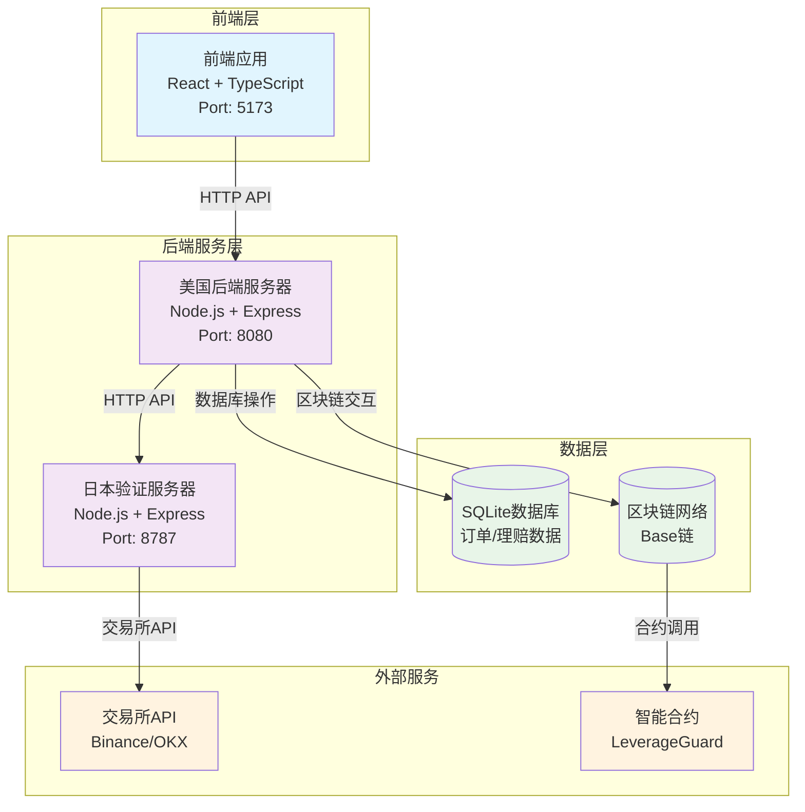

### 2. 网络通信架构

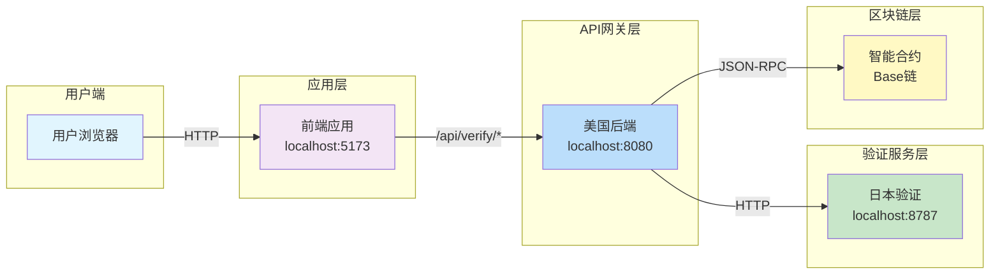

## 🔌 API调用交互图

### 1. 订单创建完整流程

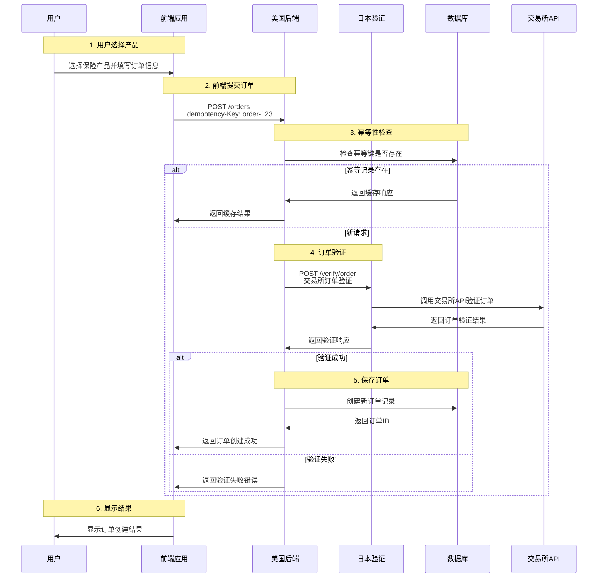

### 2. 理赔申请流程

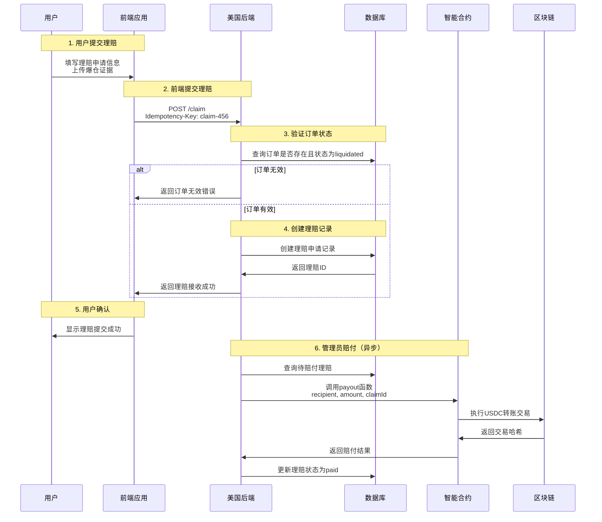

### 3. 健康检查流程

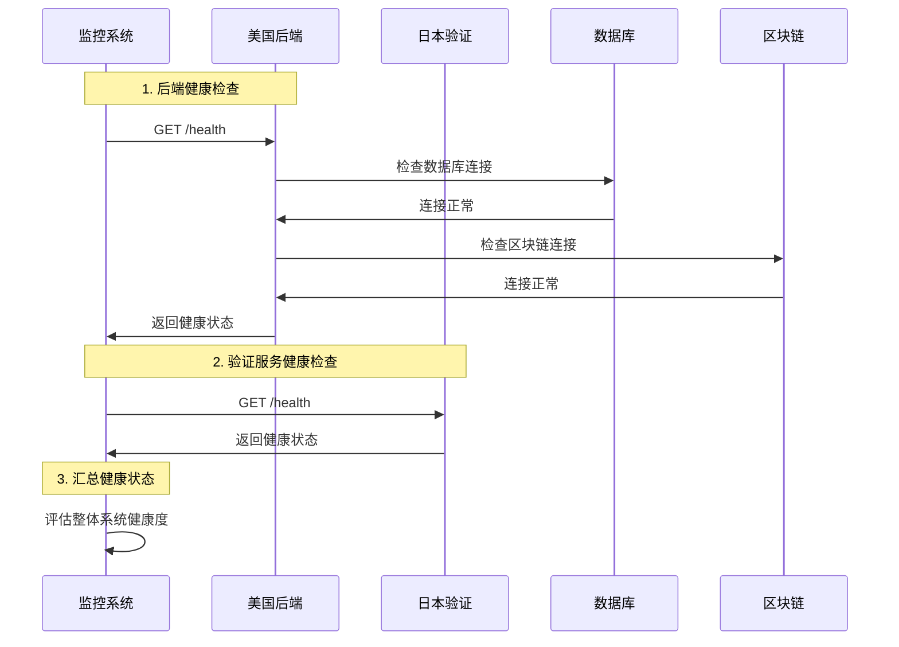

## 📊 数据流交互图

### 1. 订单数据流

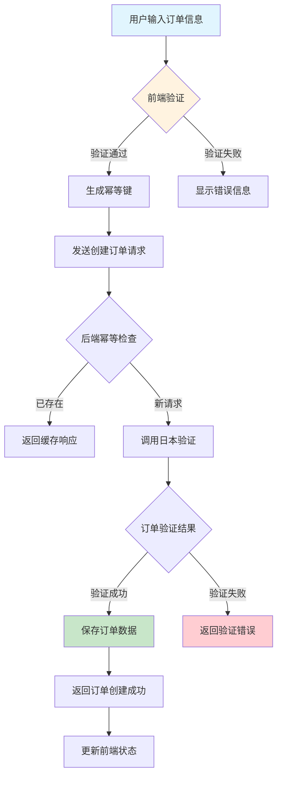

### 2. 理赔数据流

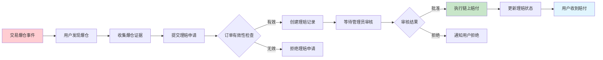

## 🔄 状态机交互图

### 1. 订单状态机

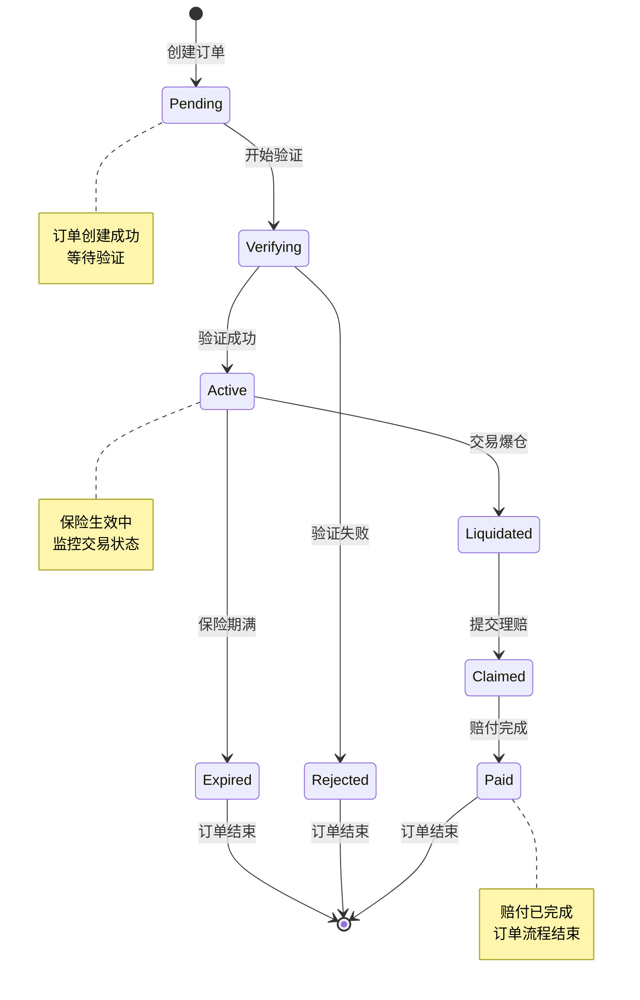

### 2. 理赔状态机

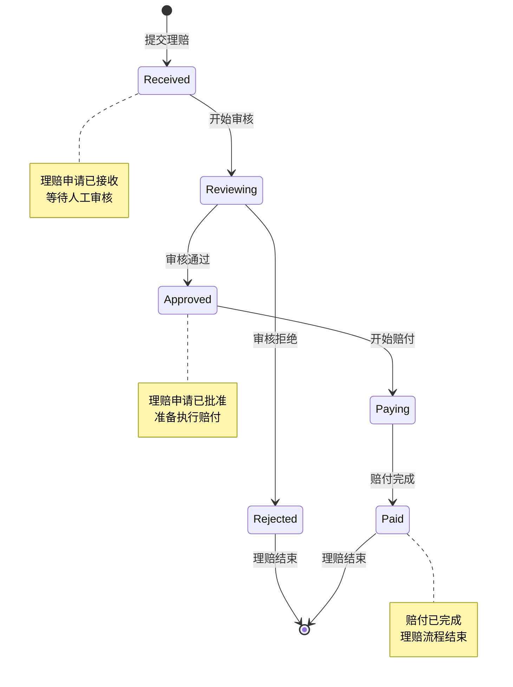

## 🏦 资金流交互图

### 1. 保费资金流

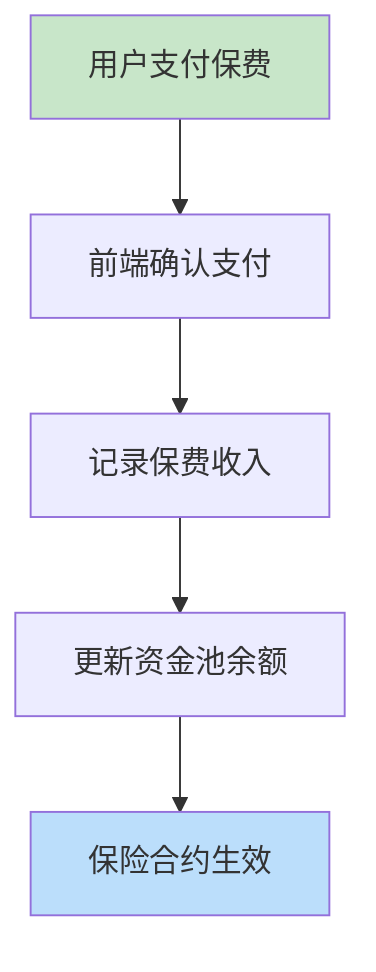

### 2. 赔付资金流

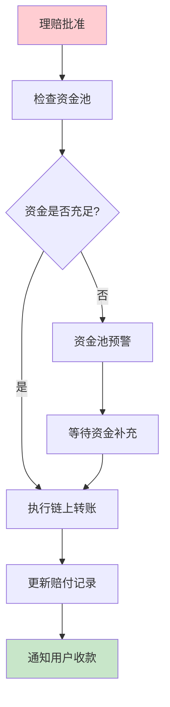

## 🔒 安全交互图

### 1. 身份验证流程

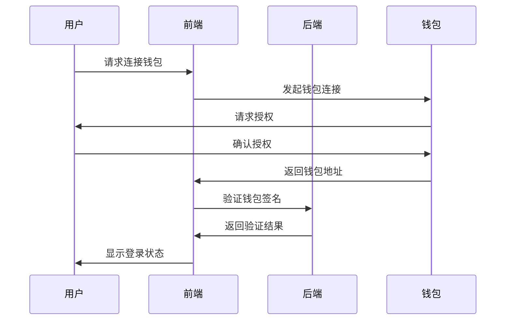

### 2. API安全调用流程

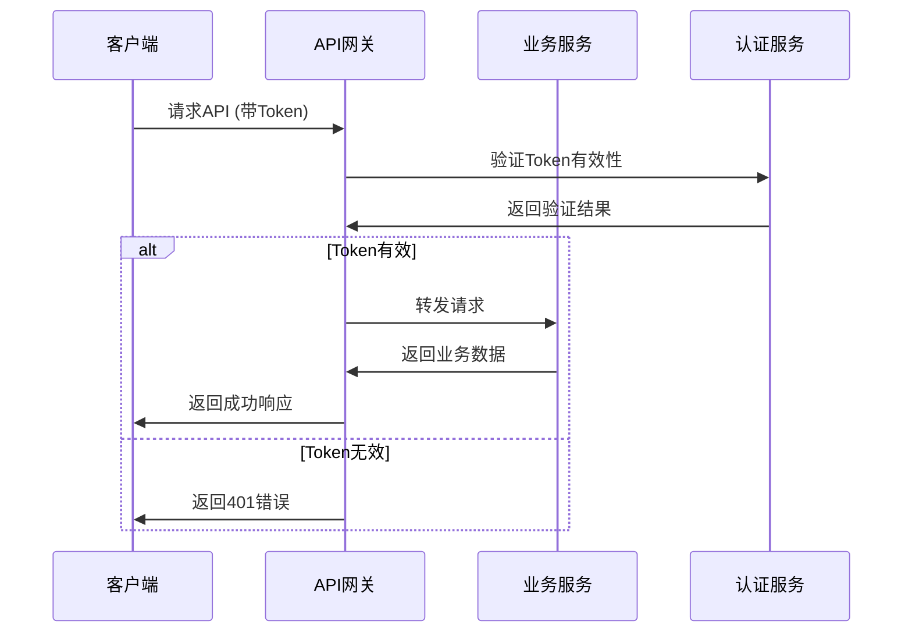

## 📈 监控交互图

### 1. 系统监控流程

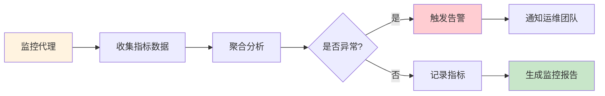

### 2. 业务监控流程

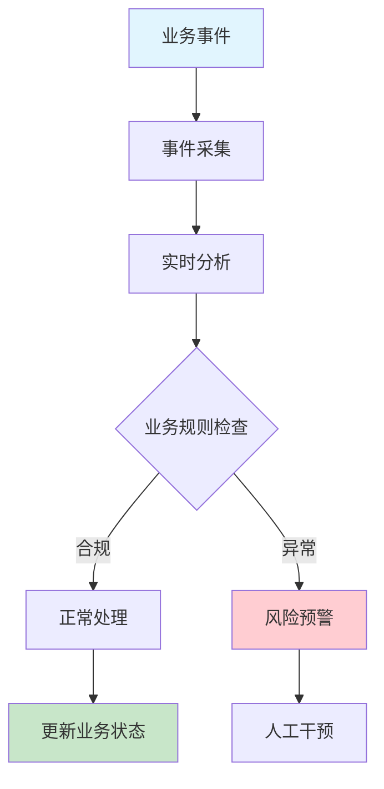

## 🔄 错误处理交互图

### 1. API错误处理流程

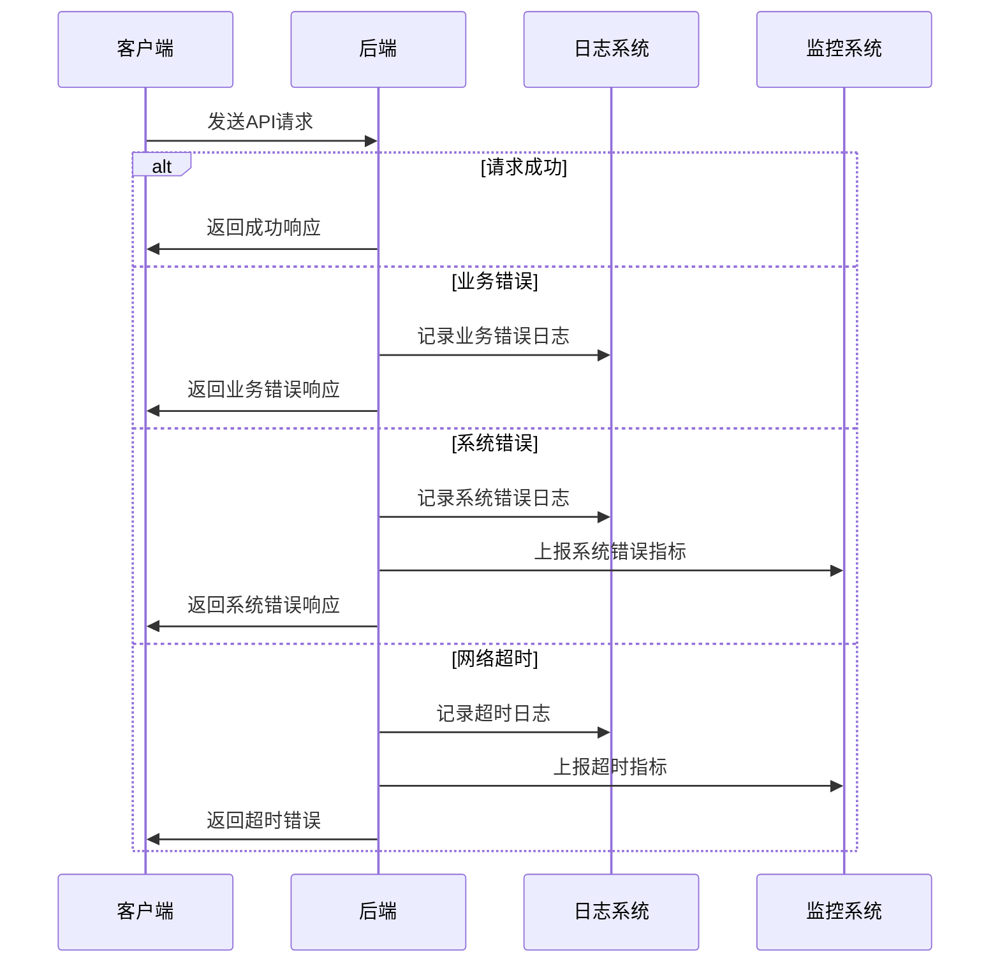

### 2. 重试机制流程

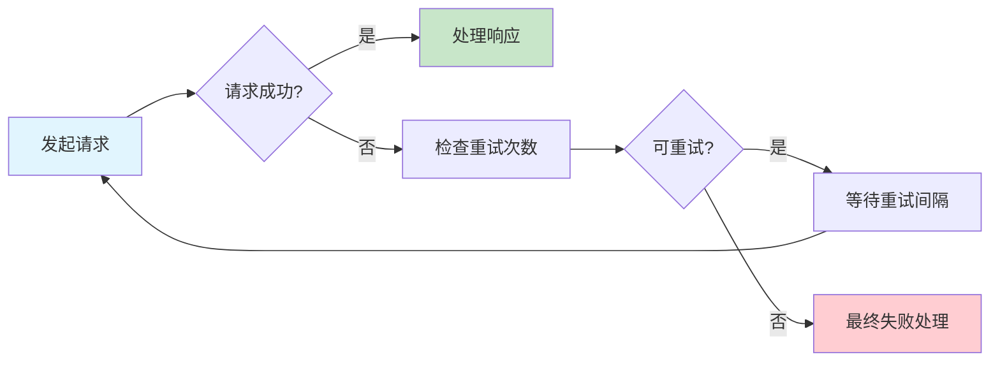

## 📋 总结

本文档通过Mermaid图表详细展示了LiqPass项目的各种交互流程，包括：

1. **系统架构交互**: 展示各组件之间的通信关系
2. **API调用流程**: 详细描述接口调用顺序和数据流转
3. **数据流交互**: 展示业务数据的处理流程
4. **状态机交互**: 描述业务状态的变化逻辑
5. **资金流交互**: 展示资金流动的安全流程
6. **安全交互**: 描述身份验证和安全调用机制
7. **监控交互**: 展示系统监控和业务监控流程
8. **错误处理**: 描述异常情况的处理机制

这些交互流程图为开发人员、测试人员和运维人员提供了清晰的系统理解，有助于快速定位问题、优化性能和确保系统稳定性。