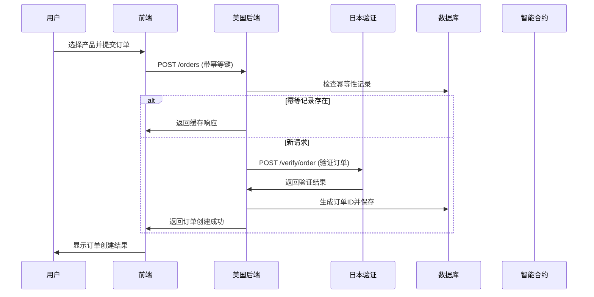
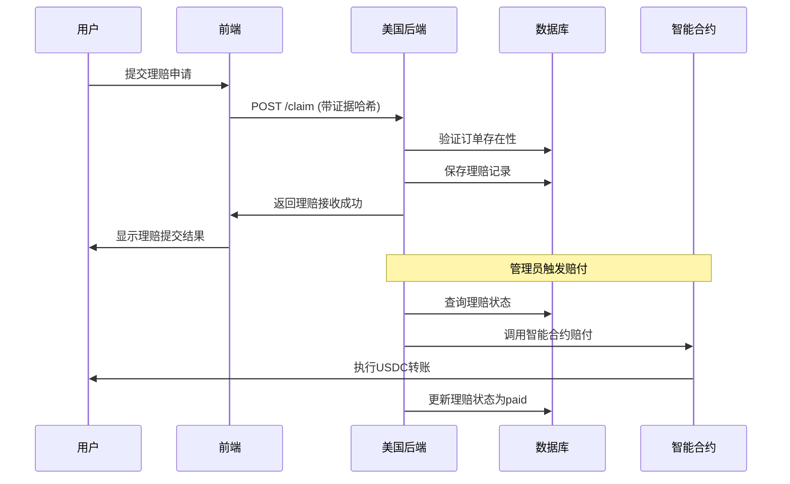

# LiqPass 项目系统架构文档

## 📋 文档概述

本文档详细描述了LiqPass项目的整体系统架构，包括前端、后端、智能合约以及服务器间交互的完整设计。

## 🏗️ 整体架构设计

### 系统组件架构
```
┌─────────────────┐    ┌─────────────────┐    ┌─────────────────┐
│   美国前端      │    │   美国后端      │    │   日本验证服务器 │
│   (React)       │    │   (Express)     │    │   (Express)     │
│   Port: 5173    │◄──►│   Port: 8080    │◄──►│   Port: 8787    │
└─────────────────┘    └─────────────────┘    └─────────────────┘
        │                       │                       │
        │                       │                       │
        ▼                       ▼                       ▼
┌─────────────────┐    ┌─────────────────┐    ┌─────────────────┐
│   用户浏览器    │    │   SQLite数据库  │    │   交易所API     │
│                 │    │                 │    │   (Binance/OKX) │
└─────────────────┘    └─────────────────┘    └─────────────────┘
        │                       │
        │                       │
        ▼                       ▼
┌─────────────────┐    ┌─────────────────┐
│   智能合约      │    │   区块链网络    │
│ LeverageGuard   │    │    (Base)       │
│                 │    │                 │
└─────────────────┘    └─────────────────┘
```

### 技术栈架构

| 组件 | 技术栈 | 主要功能 | 部署端口 |
|------|--------|----------|----------|
| **美国前端** | React + TypeScript + TailwindCSS | 用户界面、订单创建、验证提交 | 5173 |
| **美国后端** | Node.js + Express + SQLite | API服务、订单管理、理赔处理 | 8080 |
| **日本验证服务器** | Node.js + Express | 订单验证、交易所API集成 | 8787 |
| **智能合约** | Solidity + Hardhat | 链上赔付逻辑、资金管理 | Base链 |

## 🔌 网络通信架构

### 1. 前端与后端通信
- **协议**: HTTP/HTTPS
- **格式**: JSON
- **认证**: Bearer Token (可选)
- **幂等性**: Idempotency-Key 头

### 2. 后端与日本服务器通信
- **协议**: HTTP/HTTPS
- **格式**: JSON
- **认证**: 交易所API密钥
- **超时**: 8秒

### 3. 后端与区块链通信
- **协议**: JSON-RPC
- **网络**: Base主网/测试网
- **合约地址**: 0x9552b58d323993f84d01e3744f175f47a9462f94

## 📊 数据流架构

### 1. 订单创建流程


### 2. 理赔处理流程


## 🔒 安全架构

### 1. 身份验证与授权
- **前端认证**: Bearer Token (可选)
- **API密钥**: 交易所API密钥加密传输
- **合约权限**: 多签钱包治理机制

### 2. 数据安全
- **传输加密**: HTTPS/TLS
- **数据存储**: SQLite数据库加密
- **敏感信息**: API密钥加密存储

### 3. 防攻击机制
- **防重入**: 智能合约防重入锁
- **幂等性**: 所有写操作幂等性保护
- **输入验证**: 请求参数严格验证

## 💾 数据存储架构

### 1. 数据库设计

#### 订单表 (orders)
```sql
CREATE TABLE orders (
  id TEXT PRIMARY KEY,
  wallet TEXT NOT NULL,
  skuId TEXT NOT NULL,
  exchange TEXT NOT NULL,
  pair TEXT NOT NULL,
  orderRef TEXT NOT NULL,
  premium INTEGER NOT NULL,
  payout INTEGER NOT NULL,
  status TEXT NOT NULL,
  createdAt TEXT NOT NULL
);
```

#### 理赔表 (claims)
```sql
CREATE TABLE claims (
  id TEXT PRIMARY KEY,
  orderId TEXT NOT NULL,
  wallet TEXT NOT NULL,
  evidenceHash TEXT NOT NULL,
  reason TEXT NOT NULL,
  status TEXT NOT NULL,
  createdAt TEXT NOT NULL
);
```

#### 幂等键表 (idempotency_keys)
```sql
CREATE TABLE idempotency_keys (
  key TEXT NOT NULL,
  route TEXT NOT NULL,
  reqHash TEXT NOT NULL,
  respJson TEXT NOT NULL,
  createdAt TEXT NOT NULL,
  PRIMARY KEY (key, route)
);
```

### 2. 区块链数据
- **合约状态**: 用户白名单、赔付记录
- **交易记录**: 赔付交易哈希
- **资金管理**: 合约余额跟踪

## 🚀 部署架构

### 1. 服务器部署

#### 美国前端部署
```bash
# 部署路径
/srv/web/us

# 启动命令
npm run dev  # 开发环境
npm run build && npm run preview  # 生产环境
```

#### 美国后端部署
```bash
# 部署路径
/opt/liqpass/us-backend

# 启动命令
node src/server.js
```

#### 日本验证服务器部署
```bash
# 部署路径
/opt/liqpass/attestor

# 启动命令
node src/server.js
```

### 2. 环境配置

#### 前端环境变量 (.env)
```bash
VITE_US_BACKEND_BASE=/api/verify
VITE_JP_VERIFY_BASE=http://127.0.0.1:8787
```

#### 后端环境变量 (.env.us)
```bash
US_PORT=8080
PAYOUT_MODE=simulate
DEFAULT_PAYOUT_ADDRESS=0x00195EcF4FF21aB985b13FC741Cdf276C71D88A1
LOG_PATH=./logs/us-backend.log
ALLOW_ORIGIN=http://localhost:5173
PAYOUT_PRIVATE_KEY=<私钥>
BASE_RPC_URL=https://mainnet.base.org
CONTRACT_ADDRESS=0x9552b58d323993f84d01e3744f175f47a9462f94
```

#### 日本服务器环境变量 (.env)
```bash
JP_PORT=8787
VERIFY_MODE=real
OKX_BASE_URL=https://www.okx.com
BINANCE_BASE_URL=https://api.binance.com
```

## 📈 性能与扩展架构

### 1. 性能优化
- **缓存策略**: API响应缓存、静态资源缓存
- **连接优化**: HTTP/2支持、连接复用
- **负载均衡**: 多实例部署支持

### 2. 扩展性设计
- **微服务架构**: 组件化设计，易于扩展
- **数据库分片**: 支持水平扩展
- **异步处理**: 非阻塞I/O操作

## 🔍 监控与日志架构

### 1. 日志系统
- **结构化日志**: JSON格式日志记录
- **日志级别**: ERROR, WARN, INFO, DEBUG
- **日志追踪**: 请求ID追踪

### 2. 监控指标
- **API响应时间**: 请求处理时间监控
- **错误率统计**: 错误请求比例
- **资源使用**: 内存、CPU使用率

## 🛠️ 开发架构

### 1. 代码组织
```
src/
├── components/     # React组件
├── pages/         # 页面组件
├── services/      # API服务
├── contexts/      # React上下文
├── utils/         # 工具函数
└── types/         # TypeScript类型定义
```

### 2. 测试架构
- **单元测试**: Jest测试框架
- **集成测试**: API接口测试
- **端到端测试**: 用户流程测试

## 📋 总结

LiqPass项目采用现代化的微服务架构设计，具有以下特点：

1. **前后端分离**: React前端 + Node.js后端
2. **分布式部署**: 美国、日本服务器分离部署
3. **区块链集成**: 智能合约实现链上赔付
4. **安全可靠**: 多层次安全防护机制
5. **易于扩展**: 模块化设计支持水平扩展

该架构能够满足杠杆交易保险业务的高并发、高安全性需求，为后续功能扩展提供了良好的基础。